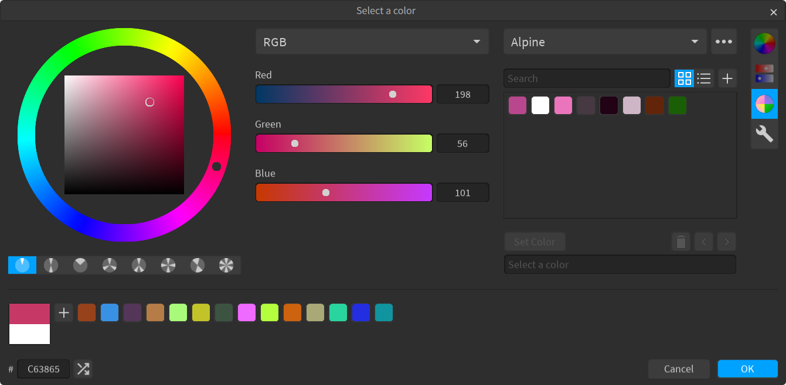
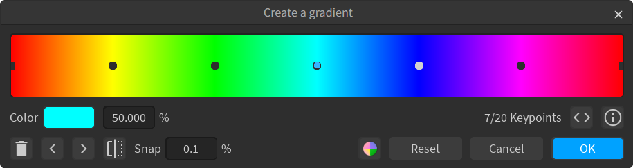

# ColorPane

ColorPane is a suite of color tools for Roblox Studio plugins. Some of the tools included are:

- A color editor with a color wheel, several types of sliders, and various color palettes, with the ability to create, import, and export your own palettes.
- A gradient editor, similar to the Studio editor, with some quality-of-life changes including keypoint snapping, buttons to swap keypoint colors around, and a gradient palette.

<picture>
  <source media="(prefers-color-scheme: dark)" src="docs/images/color-editor-dark.png">
  <source media="(prefers-color-scheme: light)" src="docs/images/color-editor-light.png">
  
</picture>

<picture>
  <source media="(prefers-color-scheme: dark)" src="docs/images/gradient-editor-dark.png">
  <source media="(prefers-color-scheme: light)" src="docs/images/gradient-editor-light.png">
  
</picture>

## Installing

**ColorPane comes in 2 parts. Install the one that applies to your situation.**

### Library

If you want to use these color tools in your own plugin, you'll want to install the ColorPane library:

If you use [Rojo](https://rojo.space), you can add the [source repository](https://github.com/Blupo/ColorPane) as a submodule. Take a look at the [Integration](https://blupo.github.io/ColorPane/developer-guide/integration) page to learn how to put these tools in your plugin.

### Companion

If you're looking to try out ColorPane to see if it's right for you, or you use a plugin with ColorPane and want to unlock it's full capabilities, you'll want to install the Companion plugin.

These additional capablities include:

* Creating and editing palettes
* Modifying settings
* Editing [color properties](https://blupo.github.io/ColorPane/user-guide/color-properties)

Take a look at the [User Guide](https://blupo.github.io/ColorPane/user-guide/color-editor) to learn how to use the color tools.

## Contributing

Found a bug? Want to request a new feature? Interested in translating ColorPane? Read the [Contributing](https://blupo.github.io/ColorPane/contributing) page for guidelines on contributing to the project!

If you like ColorPane, consider [donating](https://ko-fi.com/blupo)!