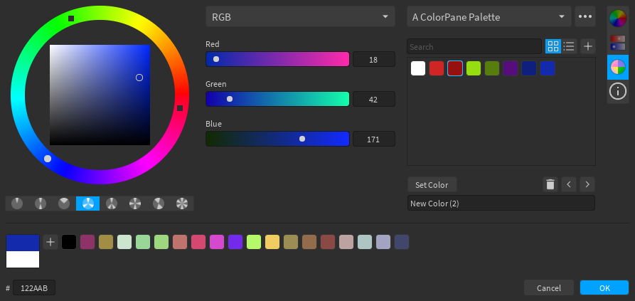

# ColorPane

ColorPane is a suite of color tools for designing Roblox games. Included in this plugin are:

- A [color editor](user-guide/color-editor/) with a color wheel, several types of sliders, and various color palettes, with the ability to create, import, and export your own palettes.
- A [gradient editor](user-guide/gradient-editor/), similar to the Studio editor, with some quality-of-life changes including keypoint snapping, buttons to swap keypoint colors around, and a gradient palette.
- A [Color Properties](user-guide/color-properties/) panel, which lets you use the color picker and gradient editor to edit the colors of parts, UIs, or other objects in your games.

ColorPane also has [an API](user-guide/api/) that allows you to use these tools in your own plugins so that you don't have to create them yourself.

## Installing

ColorPane is available in the plugin library [here](https://roblox.com/library/6474565567/ColorPane). You can also grab a [release](https://github.com/Blupo/ColorPane/releases) from GitHub and install it manually.

If you know how to use [Rojo](https://rojo.space), you can build the latest code from the development branch to get the newest features. Keep in mind that this is **development code**, and things can break or change quickly.

The release build of the plugin in the library does not share palettes or preferences with any locally-installed builds. All locally-installed builds will have the same palettes and preferences.