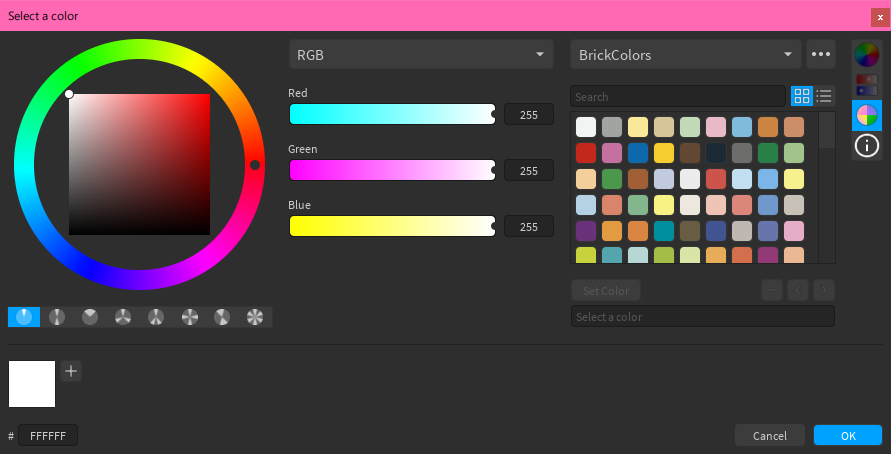
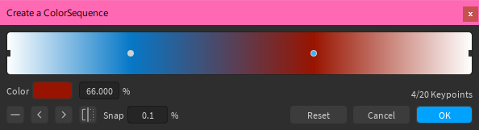
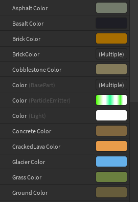

# ColorPane

ColorPane is a color editor plugin for Roblox Studio. It features pickers for colors and ColorSequences, a property editor, as well as an API for integration in other plugins.

You can install it [from the library](https://roblox.com/library/6474565567/ColorPane) or grab a [release](https://github.com/Blupo/ColorPane/releases) and install it manually. If you want to support ColorPane's development, consider [donating](https://ko-fi.com/blupo).

---

This product includes color specifications and designs developed by Cynthia Brewer ([http://colorbrewer.org/](http://colorbrewer.org/)).