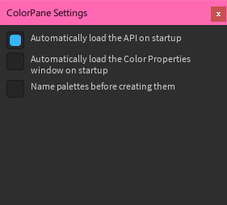

ColorPane has an API that allows other plugins to use its color pickers. As the user, you can control whether or not these plugins are allowed to use the API, and whether or not you want to allow this automatically.

To manually load the API, click on the *Load API* button in the plugin's toolbar. If the operation succeeds, the button will become disabled.

!!! info
    Loading the API requires script injection, and you will be prompted to allow this the first time you try to do it.

You also have the option to load the API automatically at startup. To do this, go to the Settings window and enable the *Automatically load the API on startup* option.

!!! info
    If you have enabled automatic loading and script injection is not allowed, a warning will be sent to the output on startup telling you that the API could not be loaded, and to enable script injection.