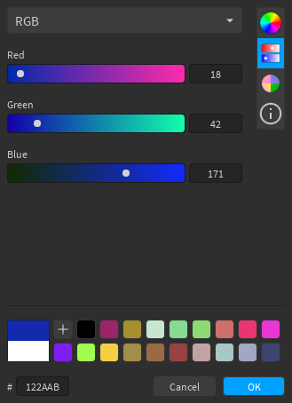
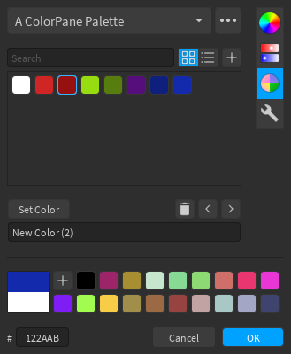
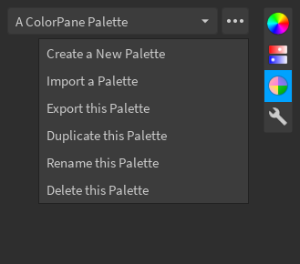
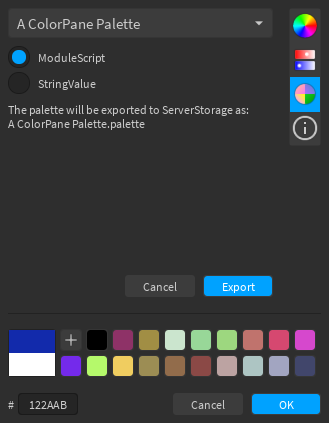
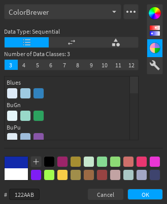
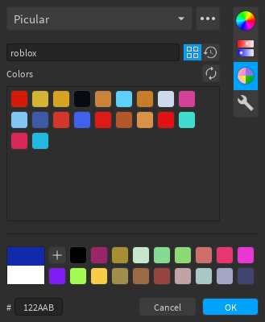
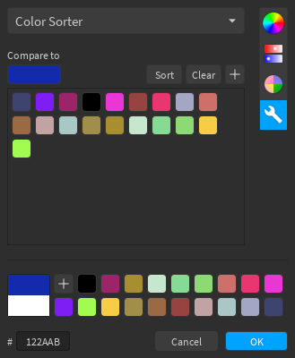
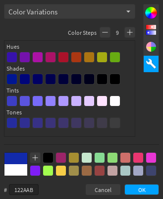
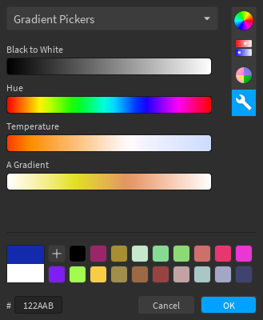
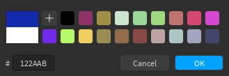

## Color Wheel

The buttons below the wheel let you select [color harmonies](https://en.wikipedia.org/wiki/Harmony_(color)), which will be marked on the wheel using squares, while the main color marker will be a circle.

## Sliders

The editor includes several sliders:

- RGB
- CMYK
- HSB/L
- Monochrome
- Temperature

## Palettes

Palettes let you store lists of colors. For most palettes, you will see (from top to bottom, left to right): a search bar, buttons to switch between grid or list layout, a button to add the current color to the palette, and the list of colors.

There are several built-in palettes, some of which have custom layouts:

- BrickColors
- [ColorBrewer](#colorbrewer-palette)
- Copic
- [Picular](#picular-palette)
- Web Colors

The overflow menu (the  button) has several options such as creating new palettes, deleting existing palettes, and importing palettes.

### Layouts

The grid layout (pictured above) is the default layout, and allows for quick access to colors. Clicking on a color will select it, which then allows you to set the current color, remove the color, change its position in the palette, or rename it.

The list layout (pictured below) is useful for palettes where color names are important. In this layout, clicking on a color (meaning the box that shows the color) will set the current color, and clicking anywhere else inside the cell will select it.

### Import and Export

Palettes can be imported and exported, for uses such as sharing them with collaborators or backing them up. You can access the import/export options from the overflow menu (the Export option does not appear for built-in palettes).

There are various ways to import palettes, but the UI will look similar for each method. After you extract the palette from the method you choose and it's in the [correct format](../../technical/palette-format/), the *Import* button will be enabled. You can also change the name of the palette before you import it, and the name input will be pre-filled with the name from the palette file/object.

!!! attention
    When importing via URL, you may be prompted by Studio to allow HTTP requests to the domain of your URL.

Palettes can be exported as ModuleScripts or StringValues to ServerStorage, and the exported object will contain the JSON string for the palette (as well as some metadata for ModuleScripts).

!!! info
    Palettes cannot be exported to JSON files, as the Roblox API does not have any functions for this. If you need a JSON file, you can copy the content of the JSON string into a file.

    For StringValue exports, you can copy the `Value` property. For ModuleScripts, copy the text inside the double-square-brackets (`[[...]]`).

### ColorBrewer Palette

[ColorBrewer](https://colorbrewer2.org) is a collection of color sets used in cartography. You can select the data type and number of classes, and the palette will display the various color sets that match the criteria.

### Picular Palette

[Picular](https://picular.co) is an online tool that lets you search "the color of anything". You can use the search bar to search for things you want the color of, e.g. "roblox". There is also a search history tab where you can view previous entries you have looked up.

## Color Tools

Various color tools are included, such as a color information tool, and a gradient picker.

### Color Info

The information tool shows the current color in different representations. You can copy text to paste somewhere else, and paste into the text boxes to change the current color (assuming what you paste follows the same format).

### Color Sorter

The sorter tool allows you to check how similar a list of colors is to a particular color, where the colors are listed from most to least similar after pressing *Sort*. The sorter uses [CIEDE2000](https://en.wikipedia.org/wiki/Color_difference#CIEDE2000).

### Color Variations

The variations tools shows various tints, tones, shades, and hue rotations of the current color, with an adjuster to change how many colors are shown.

### Gradient Pickers

The gradient pickers allow you to select a color from the different gradients in your gradient palette. Clicking anywhere on a gradient will set the current color to the color at that position. You can also click and drag to select colors as if it were a slider.

## Others

The two colors in a large square at the bottom-left of the editor represent the current (top) and initial (bottom) colors. You can click on the initial color if you want to reset the current color. The hex input below it accepts either 3 (`ABC` = `AABBCC`) or 6 (`ABCDEF`) digits.

The quick palette to the right of the large square lets you temporarily store colors for quick access. You can add as many colors as you like, but you can't remove any colors. The number of colors that the quick palette displays depends on the size of the window (i.e. a larger window displays more colors).