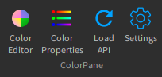
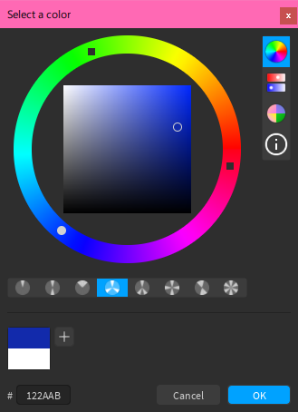
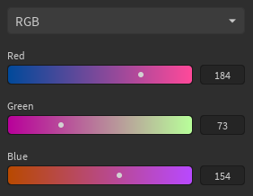
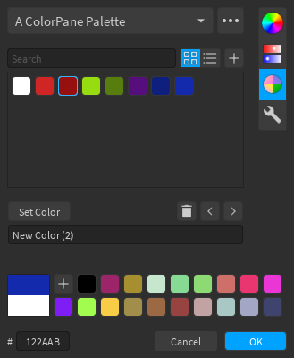
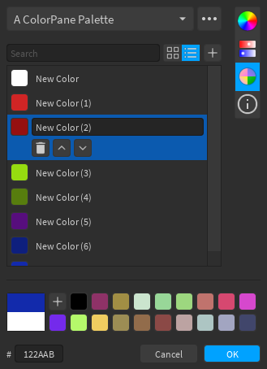
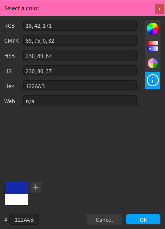
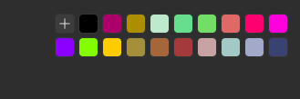
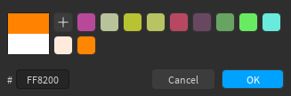

The color editor has several components to it:

[TOC]

If the editor window is large enough, then all of the components will be shown at the same time, otherwise you can use the button bar at the right of the window to pick which one to view. By default, the window is only large enough to show the wheel and sliders.

You can use the toolbar to bring up the color editor at any time using the *Color Editor* button.

## Color Wheel

The color wheel is a standard [HSB](https://wikipedia.org/wiki/HSL_and_HSV) color wheel, with a ring for the hue and an inner square for the saturation and brightness. There is also a button bar at the bottom for basic color harmonies. The main color markers are denoted as circles, while any harmonies are denoted as squares.

## Sliders

There are 6 types of sliders:

- RGB
- CMYK
- HSB
- HSL
- Monochrome (black-and-white)
- Temperature
    - Lets you pick colors corresponding to Kelvin temperatures, with some presets. Implementation is based on [neilbartlett's color-temperature](https://github.com/neilbartlett/color-temperature).

!!! hint
    On the Slider and Palette editors, you can use the scroll wheel on the respective page selector to traverse the page list without having to open the dropdown.

## Palettes

Palettes let you store lists of colors. The overflow menu lets you create, duplicate, rename and delete palettes. You can use the search bar to filter colors, and you can use the  button to add colors to the palette.

!!! hint
    By default you will be prompted to name palettes before creating them. You can disable this in the Settings.

### Grid View

Grid view (pictured above) is the default view for palettes, and allows for easy access to colors. Clicking on a color will select it, which allows you to use the color options:

- The *Set Color* button will set the current color to the selected color (you can also double-click on the color)
- The  button will remove the color from the palette
- The  and  buttons will move the color around the list
- You can rename the color using the text box

### List View

List view is useful for palettes where the color names are important. Clicking on a list item will select it, which shows the color options:

- The  button will remove the color from the palette
- The  and  buttons will move the color around the list
- The name label will turn into a text box, with which you can change the name of the color

To set the current color, click on the color box inside the list item.

### Built-In Palettes

ColorPane includes some built-in palettes:

- A [BrickColor](https://developer.roblox.com/articles/BrickColor-Codes) palette
- A page for the [ColorBrewer](https://colorbrewer2.org) palettes (clicking on a color in the ColorBrewer page will immediately set the current color instead of selecting it)
- A [web colors](https://www.w3.org/TR/2020/WD-css-color-4-20201112/#named-colors) palette

## Color Information

The information page shows the components for different color conversions. You can copy from the text boxes if you need to use the color somewhere else, or paste into the text boxes (in the format you see) to change the color.

## Quick Palette

The quick palette at the bottom of the window lets you temporarily store colors for quick access. The  button will add the current color, and clicking on a color will set the current color.

!!! info
    The quick palette will display as many colors as the size of the window can accomodate, and stores up to 99. If you add more colors after the 99th, colors will be removed from the end of the list to accommodate.

## Comparison and Hex Input

The comparison square shows the current and starting colors (on the top and bottom respectively), and you can click on the starting color to set the current color, in case you want to start over. The hex input accepts either 3 (`ABC` = `AABBCC`) or 6 (`ABCDEF`) digits.