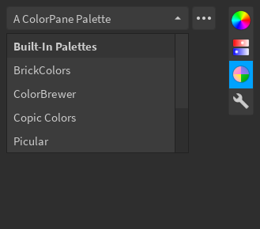

## Color Wheel

The buttons below the wheel let you select [color harmonies](https://en.wikipedia.org/wiki/Harmony_(color)), which will be marked on the wheel using squares, while the main color marker will be a circle.

## Sliders

The editor includes several sliders:

- RGB
- CMYK
- HSB/L
- Monochrome
- Temperature

## Palettes

Palettes let you store lists of colors. For most palettes, you will see a search bar, buttons to select a grid or list layout, a button to add the current color, and the list of colors, as depicted above. The dropdown lists the palettes you have, and the overflow menu has several options such as creating new palettes, deleting existing palettes, and importing palettes.

There are also several built-in palettes:

- BrickColors
- [ColorBrewer](#colorbrewer-palette)
- Copic
- [Picular](#picular-palette)
- Web Colors

### Layouts

The grid layout (pictured above) is the default layout, and allows for quick access to colors. Clicking on a color will select it, which then allows you to change the color's position in the list, rename the color, remove the color, or set the current color.

The list layout (pictured below) is useful for palettes where color names are important. In this layout, clicking on a color (meaning the box that shows the color) will set the current color, and clicking anywhere else inside the cell will select it.

### Import and Export

Palettes can be imported and exported, for things such as sharing them with collaborators or for backing up your palettes. You can access the import/export options from the overflow menu (the Export option will not appear when a built-in palette is selected).

#### Import

There are various ways to import palettes, but the UI will look similar for each method. After you extract the palette from the method you choose and the palette is determined to be in the [correct format](../../technical/palette-format/), the *Import* button will be enabled. You can also change the name of the palette before you import, which will be pre-filled with the name from the palette itself.

!!! attention
    When importing via URL, you will be prompted by Studio to allow HTTP requests to whatever domain your URL contains. If you deny this permission, you will not be able to import palettes from that domain.

#### Export

Palettes can be exported as ModuleScripts or StringValues to ServerStorage, and the exported object will contain the JSON string for the palette as well as some metadata for ModuleScripts.

!!! attention
    If exporting to a ModuleScript, you will be prompted by Studio to allow script injection. If you do not allow script injection, you will not be able to export ModuleScripts.

!!! info
    Palettes cannot be exported to JSON files, as the Roblox API does not have any functions for this. If you need to have your palette in a JSON file, you can copy the content of the JSON string into a file.

    For StringValue exports, copy the `Value` property. For ModuleScripts, copy the text inside the double-square-brackets (`[[...]]`).

### ColorBrewer Palette

[ColorBrewer](https://colorbrewer2.org) is a collection of color sets used in cartography. You can select the data type and number of classes, and the palette will display the various color sets that match the criteria. Clicking on a color will set the current color.

### Picular Palette

[Picular](https://picular.co) is an online tool that lets you search "the color of anything". You can use the search bar to search for things you want the color of, e.g. "roblox". There is also a search history tab where you can view previous entries you have looked up. Clicking on a color will set the current color.

## Color Tools

Various color tools are included, such as a color information tool, and a gradient picker.

### Color Info

The information tool shows the current color in different representations. You can copy from the text boxes to paste into somewhere else, and paste into them to change the current color, assuming what you paste follows the same format.

### Color Sorter

The sorter tool allows you to check how similar a list of colors is to a particular color. The sorter uses [CIEDE2000](https://en.wikipedia.org/wiki/Color_difference#CIEDE2000).

### Color Variations

The variations tools shows various tints, tones, shades, and hue rotations of the current color.

### Gradient Pickers

The gradient pickers allow you to select a color from the different gradients in your gradient palette. Simply click anywhere on a gradient, and the color at that position will be set. You can also click and drag to select colors as if it were a slider.

## Others

The two colors in a square on the bottom-left of the editor represent the current (top) and initial (bottom) colors. You can click on the initial color if you want to reset the current color. The hex input below it accepts either 3 (`ABC` = `AABBCC`) or 6 (`ABCDEF`) digits.

The quick palette on the right lets you temporarily store colors for quick access. You can add as many colors as you like, but you cannot remove any colors. The number of colors that the quick palette displays depends on the size of the window (i.e. a larger window displays more colors). Clicking on a color will set the current color.