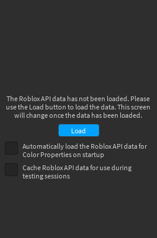

# Editing Color Properties

The Color Properties window allows you to edit the color properties of objects in your projects.

Each property will have a little icon next to its color button to indicate the type of property it is ( for BrickColors,  for Color3s, and  for ColorSequences). When multiple properties with the same name are listed, their class names will also be listed. Clicking on the color button will allow you to edit the property's value.

/// note
The Terrain material properties you will see when you select a Terrain object (e.g. "Asphalt Material", "Basalt Material", etc.) are not real properties, but you can still use them to modify Terrain colors.
///

## Activation

Color Properties will require manual activation the first time you use it. You will see a prompt when you open the window telling you that the API data has not been loaded (pictured below). On this screen you can load the API data and change the settings for automatic activation and caching (see the next section).

/// note
API data is retrieved via HTTP requests to `setup.rbxcdn.com`. You may be prompted by Studio to allow HTTP requests to this domain when you use Color Properties. If you deny this permission, you will not be able to use this part of the Companion.
///

## Play-Testing

Since HTTP requests are not allowed from plugins during play-testing, trying to use Color Properties won't work. You can enable the *Cache Roblox API data* setting to get around this, which will store the Roblox API data on your computer so that it can be used instead of having to make an HTTP request. Enabling this option may cause noticable pauses whenever the cache needs to be updated, since the size of the API data is quite large.