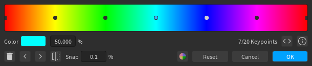
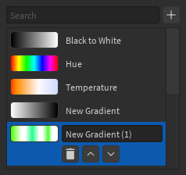

## Keypoints

You can add a keypoint by clicking anywhere in the empty space of the gradient view, as long as your cursor isn't snapped to another keypoint. Keep in mind that there is also a limit of 20 keypoints enforced by the engine.

Clicking on a keypoint will select it, which allows you to delete it, change its color or position, and use the left and right buttons to swap its color with that of another keypoint. You can also change the position by dragging it around the gradient view. The positions of the first and last keypoints are fixed, so you cannot change them.

You can use the  button to reverse the order of the keypoints, which will reverse the gradient.

## Gradient Palette

You can open the gradient palette using the palette button (has the same icon as the palette section icon of the Color Editor). Similar to [color palettes](../color-editor/#palettes), you can store gradients for later use. Unlike the color palettes, however, there is only one palette, and you cannot import/export the palette. The first 3 gradients in the palette are read-only, so you cannot modify or delete them.