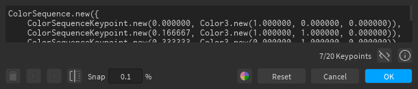
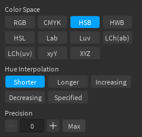

# The Gradient Editor

## Editing Keypoints

Keypoints can be added by clicking anywhere in the gradient view (as long as the cursor isn't snapped to another keypoint). Clicking on a keypoint will select it, which allows you to delete it, change its color or position, and use the left :material-chevron-left: or right :material-chevron-right: buttons (*not* the arrow keys) to swap its color with the keypoint on the left or right, respectively. You can also change the position by dragging it around the gradient view.

## Other Controls

- The :material-flip-horizontal: button reverses the order of the colors in the gradient
- The *Snap* input can be used to modify the interval at which keypoints snap
- The Reset button resets the gradient to its initial value

The :material-code-tags: button toggles showing the ColorSequence code for the gradient, if you wish to copy it. You'll probably have to increase the size of the window to view the whole code.

## Gradient Palette

You can open the gradient palette using the  button. Similar to [color palettes](color-editor.md#palettes), you can store gradients for later use. The first 3 gradients in the palette are built-in, so you cannot modify or delete them.

## Gradient Info

You can access gradient info with the :material-information-outline: button. Editing gradient information is an advanced feature that allows you to create gradients with interpolation in different color spaces. The available options for the color space and hue interpolation are the same as those used in [Color.mix](https://blupo.github.io/Color/api/color/#colormix).

Increasing precision allows you to get a more visually-accurate gradient for the specified color space, but at the cost of the number of keypoints that you're allowed to insert.

For non-RGB color spaces, the precision should be at least 1, otherwise the gradient will not look any different from itself in RGB space. For RGB space, the precision should always be 0, since ColorSequences already use RGB interpolation.